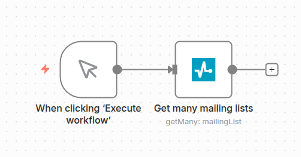
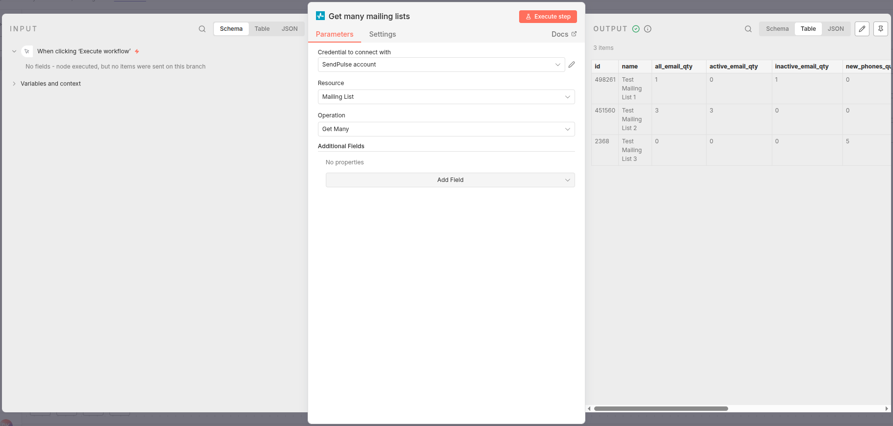
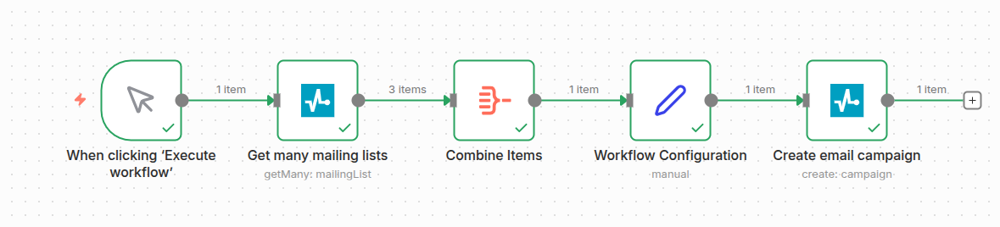
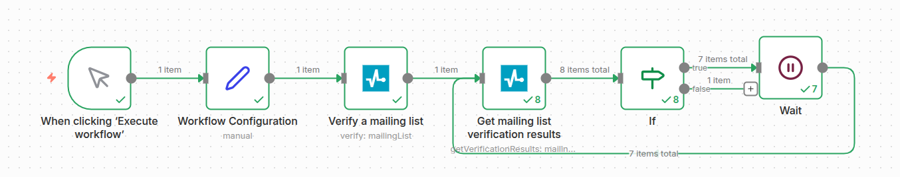
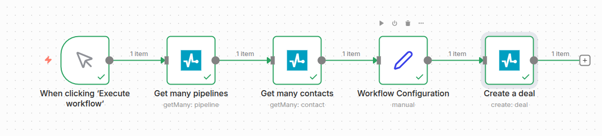

# 🚀 n8n-nodes-sendpulse


Official [SendPulse](https://sendpulse.com) integration for [n8n](https://n8n.io).

SendPulse is an all-in-one multichannel marketing and communication platform.
It combines email campaigns, SMS, web push, and chatbots with CRM, automation flows, and transactional messaging.
Using the n8n integration, teams can sync customer data, trigger personalized journeys from any app, and centralize product and growth experiments in one flexible workflow.

This repo contains SendPulse Automation360, SendPulse Chatbots, SendPulse CRM, SendPulse Email, SendPulse FileManager,
SendPulse Pop-ups, SendPulse SMS, SendPulse SMTP, SendPulse Verifier and SendPulse Web Push community nodes for n8n.

These nodes currently only supports the most popular SendPulse APIs.
If there's an API missing that you would like to use, please let us know.
In the meantime, you can also use the generic [HTTP Request](https://docs.n8n.io/integrations/builtin/core-nodes/n8n-nodes-base.httprequest/) node to construct your requests.

## 📚 Table of Contents

* [Installation](#installation)
* [Credentials](#credentials)
* [Usage](#usage)
* [Operations](#operations)
* [Workflow Examples](#workflow-examples)
* [Compatibility](#compatibility)
* [Resources](#resources)
* [License](#license)

## 📦 Installation

Follow the [installation guide](https://docs.n8n.io/integrations/community-nodes/installation/) in the n8n community nodes documentation.

## 🔐 Credentials

### Client ID & Client Secret

1. Log in to your **[SendPulse account](https://sendpulse.com)**
2. Navigate to **Account settings > API**
3. Copy your **Client ID**
4. Copy your **Client Secret**

### Access Token

The authorization process requires an access token for signing each further API request.

The necessary parameters to obtain an access token can be found in the private account settings page found on the following URL in the [API tab](https://login.sendpulse.com/settings/#api).

To get an access token you have to send a POST request to:

```
https://api.sendpulse.com/oauth/access_token
```

Request parameters:

| Parameter     | Type   | Description                             |
|---------------|--------|-----------------------------------------|
| grant_type    | string | Has to be equal to `client_credentials` |
| client_id     | string | Your ID                                 |
| client_secret | string | Your Secret                             |

## 🧩 Usage

Add any SendPulse node to a workflow:



Configure a basic query and hit "Execute step" to execute the query:



## 🛠️ Operations

All operations are documented in the [SendPulse REST API Documentation](https://sendpulse.com/integrations/api).

### 🔄 SendPulse Automation360 Node

| Resource | Operation                                                        |
|----------|------------------------------------------------------------------|
| Flow     | [Get Many](https://sendpulse.com/integrations/api/a360#get-flows) |
| Flow     | [Get](https://sendpulse.com/integrations/api/a360#get-info-flow)  |

### 🤖 SendPulse Chatbots Node

| Resource | Operation                                                                                                                                                                                                                                                                                                                                                                                                                                                                                                                                                                                                                                                                                                               |
|----------|-------------------------------------------------------------------------------------------------------------------------------------------------------------------------------------------------------------------------------------------------------------------------------------------------------------------------------------------------------------------------------------------------------------------------------------------------------------------------------------------------------------------------------------------------------------------------------------------------------------------------------------------------------------------------------------------------------------------------|
| Bot      | [Get Many](https://sendpulse.com/integrations/api/chatbot#/bots/get_bots)                                                                                                                                                                                                                                                                                                                                                                                                                                                                                                                                                                                                                                                |
| Dialog   | [Get Many](https://sendpulse.com/integrations/api/chatbot#/dialogs/get_dialogs)                                                                                                                                                                                                                                                                                                                                                                                                                                                                                                                                                                                                                                          |
| Contact  | Get ([Telegram](https://sendpulse.com/integrations/api/chatbot/telegram#/contacts/get_contacts_get), [Facebook Messenger](https://sendpulse.com/integrations/api/chatbot/facebook#/contacts/get_contacts_get), [WhatsApp](https://sendpulse.com/integrations/api/chatbot/whatsapp#/contacts/get_contacts_get), [LiveChat](https://sendpulse.com/integrations/api/chatbot/live-chat#/contacts/get_contacts_get), [Instagram](https://sendpulse.com/integrations/api/chatbot/instagram#/contacts/get_contacts_get), [Viber](https://sendpulse.com/integrations/api/chatbot/viber#/contacts/get_contacts_get), [TikTok](https://sendpulse.com/integrations/api/chatbot/tiktok#/contacts/get_contacts_get))                        |
| Contact  | Send Message ([Telegram](https://sendpulse.com/integrations/api/chatbot/telegram#/contacts/post_contacts_send), [Facebook Messenger](https://sendpulse.com/integrations/api/chatbot/facebook#/contacts/post_contacts_send), [WhatsApp](https://sendpulse.com/integrations/api/chatbot/whatsapp#/contacts/post_contacts_send), [LiveChat](https://sendpulse.com/integrations/api/chatbot/live-chat#/contacts/post_contacts_send), [Instagram](https://sendpulse.com/integrations/api/chatbot/instagram#/contacts/post_contacts_send), [Viber](https://sendpulse.com/integrations/api/chatbot/viber#/contacts/post_contacts_send), [TikTok](https://sendpulse.com/integrations/api/chatbot/tiktok#/contacts/post_contacts_send)) |
| Flow     | Run ([Telegram](https://sendpulse.com/integrations/api/chatbot/telegram#/flows/post_flows_run), [Facebook Messenger](https://sendpulse.com/integrations/api/chatbot/facebook#/flows/post_flows_run), [WhatsApp](https://sendpulse.com/integrations/api/chatbot/whatsapp#/flows/post_flows_run), [LiveChat](https://sendpulse.com/integrations/api/chatbot/live-chat#/flows/post_flows_run), [Instagram](https://sendpulse.com/integrations/api/chatbot/instagram#/flows/post_flows_run), [Viber](https://sendpulse.com/integrations/api/chatbot/viber#/flows/post_flows_run), [TikTok](https://sendpulse.com/integrations/api/chatbot/tiktok#/flows/post_flows_run))                                                           |

### 📇 SendPulse CRM Node

| Resource | Operation                                                                                                           |
|----------|---------------------------------------------------------------------------------------------------------------------|
| Contact  | [Get Many](https://sendpulse.com/integrations/api/crm#/Contacts/post_contacts_get_list)                              |
| Contact  | [Get](https://sendpulse.com/integrations/api/crm#/Contacts/get_contacts__contactId_)                                 |
| Contact  | [Get by External ID](https://sendpulse.com/integrations/api/crm#/Contacts/get_contacts_external__externalContactId_) |
| Contact  | [Create](https://sendpulse.com/integrations/api/crm#/Contacts/post_contacts_create)                                  |
| Deal     | [Get Many](https://sendpulse.com/integrations/api/crm#/Deals/post_deals_get_list)                                    |
| Deal     | [Get](https://sendpulse.com/integrations/api/crm#/Deals/get_deals__dealId_)                                          |
| Deal     | [Create](https://sendpulse.com/integrations/api/crm#/Deals/post_deals)                                               |
| Pipeline | [Get Many](https://sendpulse.com/integrations/api/crm#/Pipelines/get_pipelines)                                      |
| Pipeline | [Get](https://sendpulse.com/integrations/api/crm#/Pipelines/get_pipelines__pipelineId_)                              |
| Pipeline | [Create](https://sendpulse.com/integrations/api/crm#/Pipelines/post_pipelines)                                       |

### ✉️ SendPulse Email Node

| Resource     | Operation                                                                                                                                                                   |
|--------------|-----------------------------------------------------------------------------------------------------------------------------------------------------------------------------|
| Mailing List | [Get Many](https://sendpulse.com/integrations/api/bulk-email#lists-list)                                                                                                     |
| Mailing List | [Get](https://sendpulse.com/integrations/api/bulk-email#list-info)                                                                                                           |
| Mailing List | [Create](https://sendpulse.com/integrations/api/bulk-email#create-list)                                                                                                      |
| Email        | Add to List ([single-opt-in](https://sendpulse.com/integrations/api/bulk-email#add-email), [double-opt-in)](https://sendpulse.com/integrations/api/bulk-email#double-opt-in)) |
| Campaign | [Get Many](https://sendpulse.com/integrations/api/bulk-email#campaigns-list)                                                                                                     |
| Campaign | [Get](https://sendpulse.com/integrations/api/bulk-email#campaign-info)                                                                                                           |
| Campaign | [Create](https://sendpulse.com/integrations/api/bulk-email#create-campaign)                                                                                                      |

### 📁 SendPulse FileManager Node

| Resource | Operation                                                                    |
|----------|------------------------------------------------------------------------------|
| File     | [Upload](https://sendpulse.com/integrations/api/file-manager#/File/post_file) |


### 🪄 SendPulse Pop-ups Node

| Resource | Operation                                                                                              |
|----------|--------------------------------------------------------------------------------------------------------|
| Project  | [Get Many](https://sendpulse.com/integrations/api/pop-up#/Project/get_public_api_widgets_list)          |
| Pop-Up   | [Get Many](https://sendpulse.com/integrations/api/pop-up#/Popup/get_public_api_popups_list__projectId_) |

### 📱 SendPulse SMS Node

| Resource     | Operation                                                                                 |
|--------------|-------------------------------------------------------------------------------------------|
| Phone Number | [Add to Mailing List](https://sendpulse.com/integrations/api/bulk-sms#add-telephone)       |
| Campaign     | [Create](https://sendpulse.com/integrations/api/bulk-sms#create-campaign-for-mailing-list) |

### 📨 SendPulse SMTP Node

| Resource | Operation                                                                   |
| -------- |-----------------------------------------------------------------------------|
| Email    | [Get Many](https://sendpulse.com/integrations/api/smtp#get-emails-list-smtp) |
| Email    | [Get](https://sendpulse.com/integrations/api/smtp#email-info-smtp)           |
| Email    | [Send](https://sendpulse.com/integrations/api/smtp#send-email-smtp)          |

### ✔️ SendPulse Verifier Node

| Resource     | Operation                                                                                 |
| ------------ |-------------------------------------------------------------------------------------------|
| Mailing List | [Verify](https://sendpulse.com/integrations/api/verifier#verify-mailing-list)              |
| Mailing List | [Get Verified Lists](https://sendpulse.com/integrations/api/verifier#get-verified-lists)   |
| Mailing List | [Get Verification Results](https://sendpulse.com/integrations/api/verifier#get-results-ml) |

### 🔔 SendPulse Web Push Node

| Resource | Operation                                                                    |
| -------- |------------------------------------------------------------------------------|
| Website  | [Get Many](https://sendpulse.com/integrations/api/web-push#get-websites-list) |
| Website  | [Get](https://sendpulse.com/integrations/api/web-push#site_info)              |
| Campaign | [Create](https://sendpulse.com/integrations/api/web-push#create-push)         |

## 🧪 Workflow Examples

#### Workflow 1: Create an email campaign



**Steps:**
1. Get mailing lists
2. Combine results into one variable
3. Set sender's name, sender's email, subject, base64 encoded message content and mailing list ID
4. Send a campaign

<details>
<summary>JSON</summary>

```json
{
  "name": "Creating an email campaign",
  "nodes": [
    {
      "parameters": {},
      "type": "n8n-nodes-base.manualTrigger",
      "typeVersion": 1,
      "position": [
        0,
        0
      ],
      "id": "162576dc-89ec-4f80-902c-1a048995caa3",
      "name": "When clicking ‘Execute workflow’"
    },
    {
      "parameters": {
        "authentication": "accessToken",
        "resource": "campaign",
        "operation": "create",
        "senderName": "={{ $json.senderName }}",
        "senderEmail": "={{ $json.senderEmail }}",
        "subject": "={{ $json.subject }}",
        "htmlBody": "={{ $json.htmlBodyBase64 }}",
        "listIds": "={{ $json.mailingListId }}",
        "name": "=Black Friday",
        "additionalFields": {},
        "requestOptions": {}
      },
      "type": "CUSTOM.sendPulseEmail",
      "typeVersion": 1,
      "position": [
        832,
        0
      ],
      "id": "f0486554-11b2-4ef4-ac58-1e4c287f189b",
      "name": "Create email campaign"
    },
    {
      "parameters": {
        "assignments": {
          "assignments": [
            {
              "id": "3f41524f-412d-4a70-8871-a23c615786d6",
              "name": "senderName",
              "value": "<sender_name>",
              "type": "string"
            },
            {
              "id": "c86c494a-73cd-4ea2-b6eb-4d9190fea113",
              "name": "senderEmail",
              "value": "<sender_email>",
              "type": "string"
            },
            {
              "id": "f0b4bbee-1556-43b5-9da4-f3c1833ffb84",
              "name": "subject",
              "value": "<subject>",
              "type": "string"
            },
            {
              "id": "e0f6b188-867e-4e95-b638-b007151cf3da",
              "name": "htmlBodyBase64",
              "value": "<html_body_base_64>",
              "type": "string"
            },
            {
              "id": "82042391-f675-46be-af47-0bde90057de5",
              "name": "=mailingListId",
              "value": "=<mailing_list_id>",
              "type": "number"
            }
          ]
        },
        "options": {}
      },
      "type": "n8n-nodes-base.set",
      "typeVersion": 3.4,
      "position": [
        624,
        0
      ],
      "id": "1dffd9a3-fb32-40e1-aebd-f7346aa985f2",
      "name": "Workflow Configuration"
    },
    {
      "parameters": {
        "additionalFields": {},
        "requestOptions": {}
      },
      "type": "CUSTOM.sendPulseEmail",
      "typeVersion": 1,
      "position": [
        208,
        0
      ],
      "id": "0e1b317f-acaf-4852-bf7d-535aebbcaab3",
      "name": "Get many mailing lists"
    },
    {
      "parameters": {
        "aggregate": "aggregateAllItemData",
        "destinationFieldName": "mailingLists",
        "options": {}
      },
      "id": "7bd43960-7cae-420d-9146-130310dc0efb",
      "name": "Combine Items",
      "type": "n8n-nodes-base.aggregate",
      "typeVersion": 1,
      "position": [
        416,
        0
      ]
    }
  ],
  "pinData": {},
  "connections": {
    "When clicking ‘Execute workflow’": {
      "main": [
        [
          {
            "node": "Get many mailing lists",
            "type": "main",
            "index": 0
          }
        ]
      ]
    },
    "Create email campaign": {
      "main": [
        []
      ]
    },
    "Workflow Configuration": {
      "main": [
        [
          {
            "node": "Create email campaign",
            "type": "main",
            "index": 0
          }
        ]
      ]
    },
    "Get many mailing lists": {
      "main": [
        [
          {
            "node": "Combine Items",
            "type": "main",
            "index": 0
          }
        ]
      ]
    },
    "Combine Items": {
      "main": [
        [
          {
            "node": "Workflow Configuration",
            "type": "main",
            "index": 0
          }
        ]
      ]
    }
  },
  "active": false,
  "settings": {
    "executionOrder": "v1"
  },
  "versionId": "59ed90df-5927-4019-bfd2-5ce67858d0ee",
  "meta": {
    "templateCredsSetupCompleted": true,
    "instanceId": "791011c5d912fa3910b1b3f0a58e52e888701c971bd92f7e7fc8373a23481dcb"
  },
  "id": "JB4pgZqZbQmUT76u",
  "tags": []
}
```
</details> 

---

#### Workflow 2: Verify a mailing list and get verification results



**Steps:**
1. Start with mailing list ID input
2. Verify mailing list
3. Wait 5 seconds
4. Get mailing list verification results

<details>
<summary>JSON</summary>

```json
{
  "name": "Verify a mailing list and get verification results",
  "nodes": [
    {
      "parameters": {},
      "type": "n8n-nodes-base.manualTrigger",
      "typeVersion": 1,
      "position": [
        -80,
        144
      ],
      "id": "e6f335fe-9185-4e2a-b15b-6aaeab5151d7",
      "name": "When clicking ‘Execute workflow’"
    },
    {
      "parameters": {
        "authentication": "accessToken",
        "operation": "verify",
        "mailingListId": "={{ $json.mailingListId }}",
        "requestOptions": {}
      },
      "type": "CUSTOM.sendPulseVerifier",
      "typeVersion": 1,
      "position": [
        336,
        144
      ],
      "id": "d646a9b4-d672-4098-b243-8a0a802e0b19",
      "name": "Verify a mailing list"
    },
    {
      "parameters": {},
      "type": "n8n-nodes-base.wait",
      "typeVersion": 1.1,
      "position": [
        960,
        128
      ],
      "id": "f08cd010-c410-4140-aa7d-996e95afac04",
      "name": "Wait",
      "webhookId": "d3afa9c8-b36f-45e3-8ef5-b956a98b79c5"
    },
    {
      "parameters": {
        "conditions": {
          "options": {
            "caseSensitive": true,
            "leftValue": "",
            "typeValidation": "strict",
            "version": 3
          },
          "conditions": [
            {
              "id": "a3932ac8-334e-4d13-88d1-bb7921cb5852",
              "leftValue": "={{ $json.status }}",
              "rightValue": 0,
              "operator": {
                "type": "number",
                "operation": "equals"
              }
            }
          ],
          "combinator": "and"
        },
        "options": {}
      },
      "type": "n8n-nodes-base.if",
      "typeVersion": 2.3,
      "position": [
        752,
        144
      ],
      "id": "49a7edbc-ffd7-4126-b3e4-8078a2a0886c",
      "name": "If"
    },
    {
      "parameters": {
        "authentication": "accessToken",
        "operation": "getVerificationResults",
        "mailingListId": "={{ $('Workflow Configuration').item.json.mailingListId }}",
        "additionalFields": {},
        "requestOptions": {}
      },
      "type": "CUSTOM.sendPulseVerifier",
      "typeVersion": 1,
      "position": [
        544,
        144
      ],
      "id": "1565c302-b889-4b1e-aebb-1541da25d966",
      "name": "Get mailing list verification results",
      "credentials": {
        "sendPulseApi": {
          "id": "SguuezBTI7kLeYfQ",
          "name": "SendPulse account"
        }
      }
    },
    {
      "parameters": {
        "assignments": {
          "assignments": [
            {
              "id": "3f41524f-412d-4a70-8871-a23c615786d6",
              "name": "mailingListId",
              "value": 498261,
              "type": "number"
            }
          ]
        },
        "options": {}
      },
      "type": "n8n-nodes-base.set",
      "typeVersion": 3.4,
      "position": [
        128,
        144
      ],
      "id": "c7aa188a-7c99-44c0-b666-fb5c9c4e4c92",
      "name": "Workflow Configuration"
    }
  ],
  "pinData": {},
  "connections": {
    "When clicking ‘Execute workflow’": {
      "main": [
        [
          {
            "node": "Workflow Configuration",
            "type": "main",
            "index": 0
          }
        ]
      ]
    },
    "Wait": {
      "main": [
        [
          {
            "node": "Get mailing list verification results",
            "type": "main",
            "index": 0
          }
        ]
      ]
    },
    "Verify a mailing list": {
      "main": [
        [
          {
            "node": "Get mailing list verification results",
            "type": "main",
            "index": 0
          }
        ]
      ]
    },
    "Get mailing list verification results": {
      "main": [
        [
          {
            "node": "If",
            "type": "main",
            "index": 0
          }
        ]
      ]
    },
    "If": {
      "main": [
        [
          {
            "node": "Wait",
            "type": "main",
            "index": 0
          }
        ]
      ]
    },
    "Workflow Configuration": {
      "main": [
        [
          {
            "node": "Verify a mailing list",
            "type": "main",
            "index": 0
          }
        ]
      ]
    }
  },
  "active": false,
  "settings": {
    "executionOrder": "v1"
  },
  "versionId": "5f24f95a-2d59-4650-a899-c68663a47d85",
  "meta": {
    "templateCredsSetupCompleted": true,
    "instanceId": "791011c5d912fa3910b1b3f0a58e52e888701c971bd92f7e7fc8373a23481dcb"
  },
  "id": "S04LSCXtbAoNxzY3",
  "tags": []
}
```
</details> 

---

#### Workflow 3: Create a deal



**Steps:**
1. Get pipelines
2. Get contacts
3. Set pipeline ID, step ID, deal name, contact ID, currency and price
4. Create a deal

<details>
<summary>JSON</summary>

```json
{
  "name": "Create a deal",
  "nodes": [
    {
      "parameters": {},
      "type": "n8n-nodes-base.manualTrigger",
      "typeVersion": 1,
      "position": [
        0,
        0
      ],
      "id": "20331738-50ec-47c4-892f-015a0eccc636",
      "name": "When clicking ‘Execute workflow’"
    },
    {
      "parameters": {
        "assignments": {
          "assignments": [
            {
              "id": "444749f2-d83c-4a93-bfed-ba587dc2d16a",
              "name": "pipelineId",
              "value": "={{ $('Get many pipelines').item.json.data[0].id }}",
              "type": "number"
            },
            {
              "id": "c8e19849-6952-4440-bcfe-587b4910d5f1",
              "name": "stepId",
              "value": "={{ $('Get many pipelines').item.json.data[0].steps[0].id }}",
              "type": "number"
            },
            {
              "id": "3f41524f-412d-4a70-8871-a23c615786d6",
              "name": "dealName",
              "value": "Purchase of Electronic Equipment",
              "type": "string"
            },
            {
              "id": "9612e468-854a-4fa6-8e63-9ccddc0a247d",
              "name": "contactId",
              "value": "={{ $json.data.list[0].id }}",
              "type": "number"
            },
            {
              "id": "8d89b9f5-517a-4a97-8f22-ec683387a26e",
              "name": "currency",
              "value": "EUR",
              "type": "string"
            },
            {
              "id": "3cdbfd58-33b3-4ca2-9689-5215ba6aff7f",
              "name": "price",
              "value": 5000,
              "type": "number"
            }
          ]
        },
        "options": {}
      },
      "type": "n8n-nodes-base.set",
      "typeVersion": 3.4,
      "position": [
        624,
        0
      ],
      "id": "21c95abb-3aa6-4dac-ae9f-0a05c3c62cf5",
      "name": "Workflow Configuration"
    },
    {
      "parameters": {
        "authentication": "accessToken",
        "resource": "deal",
        "operation": "create",
        "pipelineId": "={{ $json.pipelineId }}",
        "stepId": "={{ $json.stepId }}",
        "name": "={{ $json.dealName }}",
        "additionalFields": {
          "contactIds": [
            "={{ $json.contactId }}"
          ],
          "currency": "={{ $json.currency }}",
          "price": "={{ $json.price }}"
        },
        "requestOptions": {}
      },
      "type": "CUSTOM.sendPulseCrm",
      "typeVersion": 1,
      "position": [
        832,
        0
      ],
      "id": "68c9ba9b-515e-4294-b202-cdeada51551f",
      "name": "Create a deal",
      "credentials": {
        "sendPulseApi": {
          "id": "vgJTBLhnSy833qmE",
          "name": "SendPulse account"
        }
      }
    },
    {
      "parameters": {
        "authentication": "accessToken",
        "additionalFields": {},
        "requestOptions": {}
      },
      "type": "CUSTOM.sendPulseCrm",
      "typeVersion": 1,
      "position": [
        416,
        0
      ],
      "id": "c8f0757b-e21e-43f0-b025-10db61dc6841",
      "name": "Get many contacts",
      "credentials": {
        "sendPulseApi": {
          "id": "vgJTBLhnSy833qmE",
          "name": "SendPulse account"
        }
      }
    },
    {
      "parameters": {
        "authentication": "accessToken",
        "resource": "pipeline",
        "requestOptions": {}
      },
      "type": "CUSTOM.sendPulseCrm",
      "typeVersion": 1,
      "position": [
        208,
        0
      ],
      "id": "6ef77dd7-c0bb-47c1-9653-77f19b6a3950",
      "name": "Get many pipelines"
    }
  ],
  "pinData": {},
  "connections": {
    "When clicking ‘Execute workflow’": {
      "main": [
        [
          {
            "node": "Get many pipelines",
            "type": "main",
            "index": 0
          }
        ]
      ]
    },
    "Workflow Configuration": {
      "main": [
        [
          {
            "node": "Create a deal",
            "type": "main",
            "index": 0
          }
        ]
      ]
    },
    "Create a deal": {
      "main": [
        []
      ]
    },
    "Get many contacts": {
      "main": [
        [
          {
            "node": "Workflow Configuration",
            "type": "main",
            "index": 0
          }
        ]
      ]
    },
    "Get many pipelines": {
      "main": [
        [
          {
            "node": "Get many contacts",
            "type": "main",
            "index": 0
          }
        ]
      ]
    }
  },
  "active": false,
  "settings": {
    "executionOrder": "v1"
  },
  "versionId": "789d96b0-448e-4496-a469-f96951fca290",
  "meta": {
    "templateCredsSetupCompleted": true,
    "instanceId": "791011c5d912fa3910b1b3f0a58e52e888701c971bd92f7e7fc8373a23481dcb"
  },
  "id": "IQryYdrRhRkFQQf7",
  "tags": []
}
```
</details> 

## 🧬 Compatibility

Tested with n8n version 1.123.4.

## 📖 Resources

* [n8n community nodes documentation](https://docs.n8n.io/integrations/#community-nodes)
* [SendPulse Website](https://sendpulse.com)
* [SendPulse REST API Documentation](https://sendpulse.com/integrations/api)
* [SendPulse Knowledge Base](https://sendpulse.com/knowledge-base)
* [SendPulse Community](https://community.sendpulse.com)
* [SendPulse Blog](https://sendpulse.com/blog)

## 📄 License

[MIT](LICENSE.md)

Copyright © 2025 SendPulse
